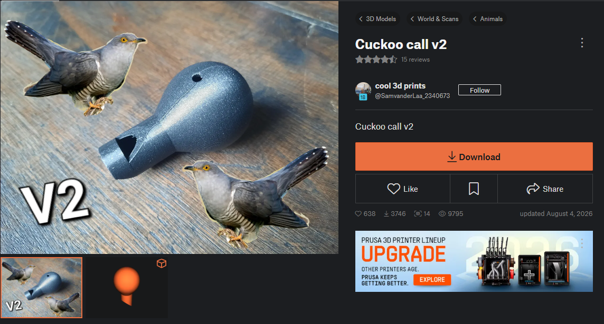

# L2 – Print Something Small

8/25/2026

**Individual Research: DfAM**

A design rule for any additive manufacturing process in general, is that any surface that overhangs more than about 45° from vertical will sag, warp, or require support material during the build, so it should be avoided if possible.

**Source:**
Mani, M., Jee, J., and Witherell, P., "Design Rules for Additive Manufacturing: A Categorization," Figure 1 (Table of Standard Elements and Design Rules, reproduced from Adam & Zimmer, 2014)

**Individual Research: FDM**

Layer adhesion is an incredibly annoying problem in FDM printing. You have been waiting for your part to be made and right when is about to be done a layer separates from the part and messes up the whole part. This problem is usually due to the settings of the printer not being right for the material, or it could possibly be moisture trapped in the material from poor storage. The material might be too cold out of the extruder and not bond to the previous layer, or the material could be too mosit and the gasses from that moisture when heated prevent it from correctly sticking to the previous layer. it is important to understand the material you are working on, the settings needed for your print, and the correct way to store it.

**Source:**
Polymaker. (n.d.). Poor layer adhesion. Polymaker Wiki. Retrieved August 25, 2026, from https://wiki.polymaker.com/printing-tips/common-printing-issues/poor-layer-adhesion

**Discussion**

My classmate Luz explained to me the importance of orientation in printing in order to save time, money (by saving material) and increase the chances of the print to succeed. We also discussed overhang and how different materials and temperature settings allow for more overhang.

Now with my print....

**Download**

I was tasked to go on printables.com and find a part to print in class. The rules where the following:
1. No more than .25 inches tall
2. Print in PLA
3. No more than 2 inches by 2 inches
4. Print time < 1.5 hours
5. Must have a flat surface to build on

And personally, I didn't want to print something that was going to end up in the trash immediately. It's surprising the amount of useless junk that can be found in these pages.

Some of the finalists were:

A bird whistle that imitates a cuckoo...Cool, but decided not to go for it because it would definitely end up being put in the back of a drawer after 2 minutes of use.

A flying disc that promised a very long range, for a very cheap amount of time and resources. But after thinking about it for about 4 seconds, I realized I was going to take about 4 seconds to loose it, and it would take about 4000 years to decompose. Didn't feel like a good decision.

I decided to go for this 2x2 Lego brick (https://www.printables.com/model/1142914-lego-2x2). It adhered to all the rules perfectly, and since my team mates agreed to print Lego bricks too, by the end of the lab we could build...something?? I don't mind keeping it since I already have a Lego box, and maybe it will come in handy sometime. Either to me or the heir of the Lego box.

**Processor**

So I downloaded the STL and opened it on the Prusa Slicer. Now I have to decide what settings to use for the part. I decided to print it with the bottom of the part on the print bed. This is because regardless of how I orient it there will be a small overhang, and oriented this way the overhang will be in a non-visible surface, which is good because I don't want supports and the slight stringing won't be noticeable.

I didn't scale it because it fit size and time criteria, and because if I make it any bigger or smaller it won't work with the rest of my Legos. I didn't bother changing the infill either because with the wall thickness of the part, there wouldn't really be infill anyway. I did make sure that the nozzle and bed temperature, as well as print speed and acceleration, were good for PLA used. The following are my settings.

Then I hit "slice now" and downloaded the G-code. I didn't run into any errors, the print was simple and I have some experience printing PLA.

**Print**

The print was simple, once the G-code was downloaded into the pen drive, and the drive ejected safely, it's simply a matter a plugging it into the printer and pressing "print". The Printer has autocalibration. 

I printed with James McAdam and Joel Holder, using a Prusa Core one numbered #.

**Lessons Learned**

1. One cool thing I noticed from this print is that, even though the overhang is too big of an angle, it didn't really mess up the layer because the overhang distance was so small.
2. Additive manufacturing isn't perfect. After getting back home with my brand new Lego brick I decided to test-fit it with another brick I had, and quickly realized that commercial printers like the Prusa Core One, although it is a great commercial printer, cannot rival an injection molded part like a real Lego brick. In comparison, the walls are uneven and don't fit perfectly flush like a real Lego would.
3. Another cool thing I noticed is that while searching for ideal PLA temperature settings, I read that different colors of the same material actually have slightly different print temperatures. This makes sense since they would retain heat slightly differently.
4. The printer isn't that smart. Although the one used does have cool features like auto-calibration, the print quality is really based on what settings and information you give the printer. It will blindly follow orders and the results of your print will be determined by the quality of the slice (within the hardware limitations of the machine, of course).

**Resources**

https://www.printables.com/model/1800042-cuckoo-call-v2

https://www.printables.com/model/1818310-flying-disc-065g-5min-printing-30-meters

https://www.printables.com/model/1142914-lego-2x2/files

https://forum.prusa3d.com/forum/prusa-core-one-how-do-i-print-this-printing-help/what-temperatures-are-you-guys-using-for-pla/

https://help.prusa3d.com/article/pla_2062

https://forum.makerforums.info/t/is-it-possible-that-coloured-pla-filament-require-more-heat-than-black-filament/46442

**Aknowledgement:**
PLA doesn't take 4000 years to decompose, it is more like 100-1000 years, but I used the initial figure for dramatic purposes. 
